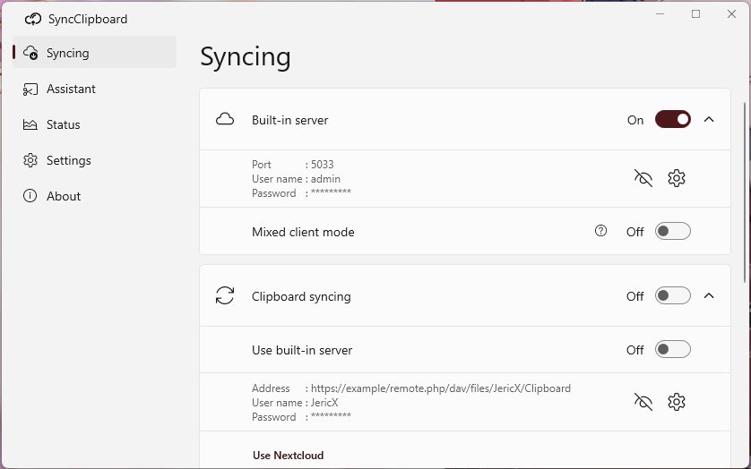
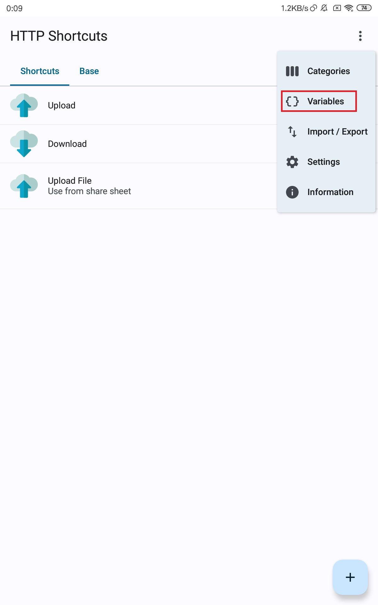
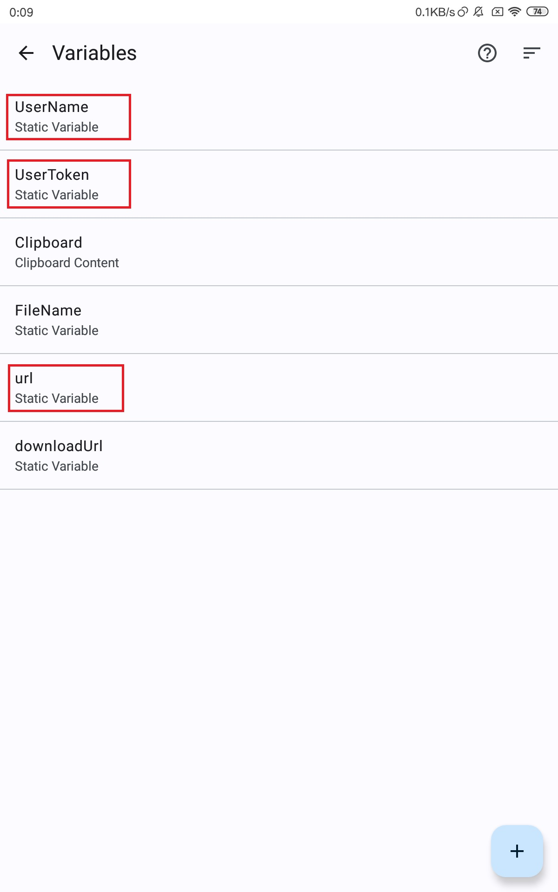

# SyncClipboard
[](https://github.com/Jeric-X/SyncClipboard/actions?query=branch%3Amaster)

[中文](../README.md) | English

<details>
<summary>Contents</summary>

- [SyncClipboard](#syncclipboard)
  - [Features](#features)
  - [Server](#server)
    - [Standalone Server](#standalone-server)
    - [Desktop Client Built-in Server](#desktop-client-built-in-server)
    - [WebDAV Server](#webdav-server)
  - [Client](#client)
    - [Windows](#windows)
    - [Linux, macOS](#linux-macos)
    - [IOS](#ios)
      - [Use Shortcuts](#use-shortcuts)
    - [Android](#android)
      - [Use HTTP Request Shortcuts](#use-http-request-shortcuts)
      - [Use Autox.js](#use-autoxjs)
    - [Notes for Clients](#notes-for-clients)
  - [API](#api)
    - [Download/Upload Text](#downloadupload-text)
    - [Download/Upload File/Image](#downloadupload-fileimage)
    - [SyncClipboard.json](#syncclipboardjson)
    - [Others](#others)
  - [Open Source Dependencies](#open-source-dependencies)

</details>

## Features

- Clipboard syncing, using a WebDAV server or built-in server, supporting text/image/file.  
- Optimize image type clipboard:
  - Paste image to a textbox directly after copying a image file from file system, and vice versa.
  - Download the original file and copy it after copying a image in web browser. This is helpful for copying an animated image in browser. Web sites always prevent downloads from non-browser, so this feature isn't always usable.
  - Copy the transcoded temporary image file (jpg or gif) after copying a modern image file type (heic, webp, etc.).

## Server
### Standalone Server
[SyncClipboard.Server](https://github.com/Jeric-X/SyncClipboard/releases/) is cross-platform, depends on [ASP.NET Core 6.0](https://dotnet.microsoft.com/en-us/download/dotnet/6.0). Run with:
```
dotnet /path/to/SyncClipboard.Server.dll --contentRoot ./
```
Content root folder is `SyncClipboard.Server.dll`'s parent folder, there will be temporary folders created when running.  
Port, username, password can be changed in `appsettings.json`.  
Choosing a different content root folder is possible. Copy a new `appsettings.json` to the folder and run with:
```
dotnet /path/to/SyncClipboard.Server.dll --contentRoot /path/to/contentRoot
```
Notes：
- Address to fill in client is `http://ip(or domain name):port`, nothing can be omitted.
- Http is not encrypted, including username and password. Maybe a https reverse proxy is needed on public network.

### Desktop Client Built-in Server
Desktop client (Windows/Linux/macOS) has a built-in server, basically the same as standalone server but can be configured with GUI.

### WebDAV Server
  
Tested server：   
- [x] [Nextcloud](https://nextcloud.com/)
- [x] [坚果云](https://www.jianguoyun.com/) 
- [x] [AList](https://alist.nn.ci/)

## Client

Clipboard is auto-synced between desktop clients running on Windows/Linux/macOS.

<details>
<summary>Screenshots</summary>



</details>

### Windows   
Download the `SyncClipboard.zip` from [Release](https://github.com/Jeric-X/SyncClipboard/releases/) Page.  
After extracting, run `SyncClipboard.exe`.  
  
Dependencies：   
- [.NET 6.0 Desktop](https://dotnet.microsoft.com/en-us/download/dotnet/thank-you/runtime-desktop-6.0.16-windows-x64-installer) runtime
- [ASP.NET Core 6.0](https://dotnet.microsoft.com/en-us/download/dotnet/thank-you/runtime-aspnetcore-6.0.16-windows-x64-installer) runtime    
- Windows10 2004 or above
- Microsoft [Segoe Fluent Icons](https://learn.microsoft.com/zh-cn/windows/apps/design/style/segoe-fluent-icons-font). It is included by default on Windows 11. You can download it [here](https://aka.ms/SegoeFluentIcons).

### Linux, macOS
Downloading page: [SyncClipboard.Desktop](https://github.com/Jeric-X/SyncClipboard.Desktop/releases)  

Notes:
- File name with `no-self-contained`: [.NET 6.0 Desktop](https://dotnet.microsoft.com/en-us/download/dotnet/6.0) runtime and [ASP.NET Core 6.0](https://dotnet.microsoft.com/en-us/download/dotnet/6.0) runtime are required.
- File name with `self-contained`: should run with no dependencies.
- Config files are saved in `~/.config/SyncClipboard/`. Uninstaller won't delete them. Users can delete them manually.
- Not suport upgrading directly. Delete old version first, then install the new version.
- Plenty of bugs exist.

### IOS 
#### Use [Shortcuts](https://apps.apple.com/us/app/shortcuts/id1462947752)  

Import this [Shortcuts](https://www.icloud.com/shortcuts/2fc4453de31442118fccea7488caa881). Use it from widget or share sheet.

### Android
#### Use [HTTP Request Shortcuts](https://play.google.com/store/apps/details?id=ch.rmy.android.http_shortcuts)
Import this [file](/script/en/shortcuts.zip), Change the `UserName`, `UserToken`, `url` in `Variables` to yours. `HTTP Request Shortcuts` supports using shortcuts from drop-down menu, home screen widgets, home screen icons and share sheet.

<details>
<summary>Screenshots</summary>





</details>

#### Use [Autox.js](https://github.com/kkevsekk1/AutoX)
Import this [js file](/script/SyncAutoxJs.js). Change the user config. And set a running trigger, for example, running the script when Android system startup.
```
// START  User Config  
const url = 'http://192.168.5.194:5033'               // no slash(/) at the end of url
const username = 'admin'
const token = 'admin'
const intervalTime = 3 * 1000                         // 3 seconds
const showToastNotification = true
// END    User Config  
```
Running in background, the script will download the remote text clipbaord automatically and set it to local clipboard. 
If satisfy any of the following conditions, upload is automatic.
- The app is running in forground
- Android 9 Pie or lower Android version
- Use root-based tools like Magisk/Xposed to unlock the limition of clipboard operation in background. There are some references:
  - https://github.com/Kr328/Riru-ClipboardWhitelist
  - https://github.com/GamerGirlandCo/xposed-clipboard-whitelist


### Notes for Clients

There are three necessery config(maybe different words, same uses).
- username
- password
- url, format is `http://ip(or domain name):port`. When using a WebDav server, url needs to be pointed to a specific existing folder as the working folder, like `https://domain.com/dav/folder1/working%20folder`. File name is the best not to contain any special characters or spaces, or you'll have to URL encode it. And do not use this folder to do anything else. If not using a desktop client(Windows/Linux/macOS), create a folder named `file` in the working folder to sync files. Desktop clients create this folder automatically.

## API

### Download/Upload Text
```
GET /SyncClipboard.json
PUT /SyncClipboard.json
```

### Download/Upload File/Image
```
GET  /SyncClipboard.json
HEAD /file/filename         // optional
GET  /file/filename

PUT /file/filename
PUT /SyncClipboard.json
```

### SyncClipboard.json
```
{
    "Type" : "Text"
    "Clipboard" : "Content",
    "File":""
}

{
    "Type": "Image", // or "File"
    "Clipboard": "md5 hash, optional",
    "File": "filename"
}
```

### Others
```
PROPFIND    /
PROPFIND    /file
MKCOL       /file
DELETE      /file
```

## Open Source Dependencies
[Magick.NET](https://github.com/dlemstra/Magick.NET)  
[Windows Community Toolkit Labs](https://github.com/CommunityToolkit/Labs-Windows)  
[.NET Community Toolkit](https://github.com/CommunityToolkit/dotnet)  
[H.NotifyIcon](https://github.com/HavenDV/H.NotifyIcon)  
[WinUIEx](https://github.com/dotMorten/WinUIEx)  
[moq](https://github.com/moq/moq)  
[Avalonia](https://avaloniaui.net/)  
[FluentAvalonia.BreadcrumbBar](https://github.com/indigo-san/FluentAvalonia.BreadcrumbBar)  
[FluentAvalonia](https://github.com/amwx/FluentAvalonia)  